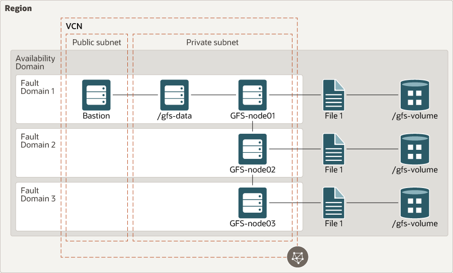

# oci-gluster

A scalable, distributed network file system is suitable for data-intensive tasks such as image processing and media streaming. When used in high-performance computing (HPC) environments, [GlusterFS](https://www.gluster.org/) delivers high-performance access to large data sets, especially immutable files.

This reference architecture contains the infrastructure components required for a distributed network file system. It contains three bare metal instances, which is the minimum required to set up high availability for [GlusterFS](https://www.gluster.org/) on [Oracle Cloud Infrastructure (OCI)](https://cloud.oracle.com/en_US/cloud-infrastructure).

For details of the architecture, see [_Deploy a scalable, distributed file system using GlusterFS_](https://docs.oracle.com/en/solutions/deploy-glusterfs/index.html)

## About
A Parallel File System distributes file data across multiple servers and provides concurrent access by multiple tasks of a parallel application. Used in high-performance computing (HPC) environments, a Parallel File System delivers high-performance access to large data sets.

A Parallel File System cluster includes nodes designated as one or more clients, plus management servers, storage servers, and metadata servers. Storage servers hold file data, while metadata servers store statistics, attributes, data file-handles, directory entries, and other metadata. Clients run applications that use the file system by sending requests to the servers over the network.

Enterprises can scale capacity, performance, and availability on demand, with no vendor lock-in, across on-premise, public cloud, and hybrid environments. Gluster is used in production at thousands of enterprises spanning media, healthcare, government, education, web 2.0, and financial services.

There are several open source Parallel File Systems available for HPC environments including Lustre, GlusterFS, and BeeGFS.

Enterprises can scale capacity, performance, and availability on demand, with no vendor lock-in, across on-premise, public cloud, and hybrid environments. Gluster is used in production at thousands of enterprises spanning media, healthcare, government, education, web 2.0, and financial services.

## Advantages of Gluster
* Scales to several petabytes
* Handles thousands of clients
* POSIX compatible
* Uses commodity hardware
* Can use any ondisk filesystem that supports extended attributes
* Accessible using industry standard protocols like NFS and SMB
* Provides replication, quotas, geo-replication, snapshots and bitrot detection
* Allows optimization for different workloads
* Open Source

Enterprises can scale capacity, performance, and availability on demand, with no vendor lock-in, across on-premise, public cloud, and hybrid environments. Gluster is used in production at thousands of enterprises spanning media, healthcare, government, education, web 2.0, and financial services.
 
## Deploy Using Oracle Resource Manager

1. Click [](https://cloud.oracle.com/resourcemanager/stacks/create?region=home&zipUrl=https://github.com/oracle-quickstart/oci-gluster/raw/master/resource-manager/oci-gluster-stack-latest.zip)

    If you aren't already signed in, when prompted, enter the tenancy and user credentials.

2. Review and accept the terms and conditions.

3. Select the region where you want to deploy the stack.

4. Follow the on-screen prompts and instructions to create the stack.

5. After creating the stack, click **Terraform Actions**, and select **Plan**.

6. Wait for the job to be completed, and review the plan.

    To make any changes, return to the Stack Details page, click **Edit Stack**, and make the required changes. Then, run the **Plan** action again.

7. If no further changes are necessary, return to the Stack Details page, click **Terraform Actions**, and select **Apply**. 

## Deploy Using the Terraform CLI

### Clone the Module
Now, you'll want a local copy of this repo.  You can make that with the commands:

    git clone https://github.com/oracle-quickstart/oci-gluster.git
    cd oci-gluster/
    ls

### Prerequisites
First off, you'll need to do some pre-deploy setup.  That's all detailed [here](https://github.com/cloud-partners/oci-prerequisites).

Secondly, create a `terraform.tfvars` file and populate with the following information:

```
# Authentication
tenancy_ocid         = "<tenancy_ocid>"
user_ocid            = "<user_ocid>"
fingerprint          = "<finger_print>"
private_key_path     = "<pem_private_key_path>"

# Region
region = "<oci_region>"

# Compartment
compartment_ocid = "<compartment_ocid>"

# Availablity Domain 
availablity_domain_name = <availablity_domain_name>   # for example "GrCH:US-ASHBURN-AD-1"

````    

## Update variables.tf file (optional)
This is optional, but you can update the variables.tf to change compute shapes, block volumes, etc. 

### Create the Resources
Run the following commands:

    terraform init
    terraform plan
    terraform apply

### Destroy the Deployment
When you no longer need the deployment, you can run this command to destroy the resources:

    terraform destroy

## Architecture Diagram


